# SUZHOU GUSU

# USLEEP MEDICAL CENTER

# 苏州姑苏优眠医学中心

# ⼀站式守护苏州⼉童⻘少年⼼理健康专业解决家庭睡眠管理/精神⼼理健康需求

# USLEEP优眠

# 苏州姑苏优眠医学中⼼

# USLEEPVISION

# 姑苏优眠愿景

# 构建健康智慧的精神世界

# 成就⾝⼼共济的健康⼈⽣

USLEEPBuild a healthy and wise spiritual world

Achieve a healthy life with physical and mental harmony

# 站式守护苏

# 苏州姑苏优眠医学中⼼

# USLEEPMISSION

# 姑苏优眠使命

# 让⼈⼈拥有优质睡眠健康⼼理

Enable everyone to have quality sleep and a healthy mindset

# 医学中⼼简介

INTRODUCTIONTOSUZHOUGUSUUSLEEPMEDICALCENTER

苏州姑苏优眠医学中⼼

打造以医⽣与来访者为核⼼的多元⼀体化平台,

全国范围内⾸次引进的斯坦福加速智能神经调控诊疗模式，

精准靶点⾼效治疗精神⼼理疾病。

中⼼拥有专业的⼼理诊疗团队，

针对各类⼼理困扰提供个性化的咨询服务及预防⼲扰;

拥有AI智能深度睡眠产品,

通过环境优化与⼼理疏导,重塑健康睡眠，

主要产品包括智能⽌鼾枕、智能床垫及配套应⽤程序,

通过数据检测、调节从⽽达到改善睡眠。

# 睡眠障碍

5

五优服务

# 心理咨询

七⼤品质

# 精神心理障碍

30年 年

从业经验

# 办院理念

# HOSPITALOPERATIONPHILOSOPHY

深耕睡眠医学领域多年，我们深感当前睡眠障碍诊疗存在碎⽚化、精准化不⾜的痛点，也⽬睹⽆数患者因睡眠问题影响⽣命质量,我们发现⾏业存在⽣理诊疗与⼼理⼲预割裂、科研成果转化滞后的核⼼痛点，⼤量患者因“⾝⼼同治”缺失、技术应⽤不及时，难以摆脱睡眠困境。

创办苏州姑苏优眠医学中⼼，旨在构建“多学科协作（MDT） $^ +$ ⼼理咨询深度融合”体系，同步推进睡眠疾病临床研究与技术转化，形成“筛查-诊断-⼲预-康复-科研”全周期诊疗闭环，打造区域睡眠健康学术⾼地，以专业医疗与科研⼒量，守护⼤众⽣命健康节律。

# 核⼼优势

# HOSPITAL'SCOREADVANTAGES

# 先进的医疗技术

ADVANCEDMEDICALTECHNOLOGY

针对不同的患者，苏州姑苏优眠采⽤“⼼理⼲预为先，技术治疗为辅”的治疗模式 通过医学理论研究与临床实践相结合，提供多样性的创新治疗⽅案，帮助每⼀位患者改善⼼理和睡眠健康，重新找回⽣活的平衡和幸福。

中⼼引进了国际最前沿的治疗技术包括斯坦福加速智能神经调控疗法(SAINT)、经颅磁刺激、经颅电治疗、⽣物反馈治疗、中医隔物灸疗等。结合科学与创新，从⽽快速、有效地改善患者的⼼理和睡眠问题。

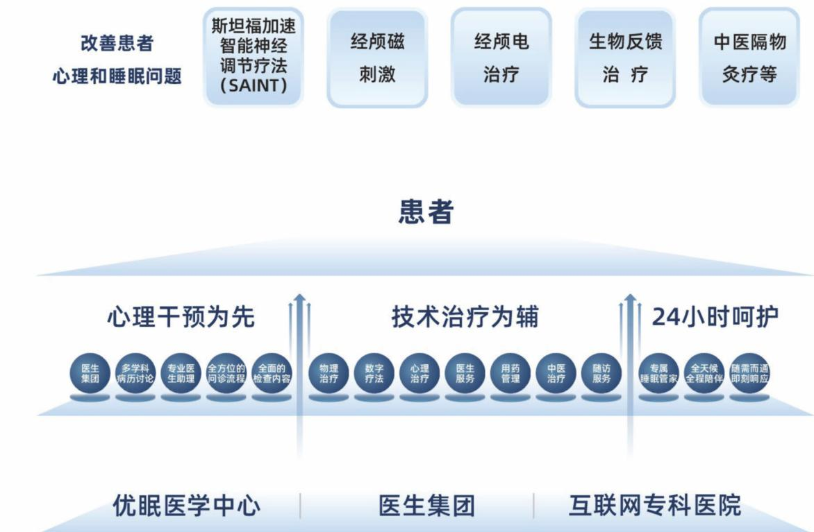

# 顶尖的专家团队

TOPTEAMOFMEDICALEXPERTS

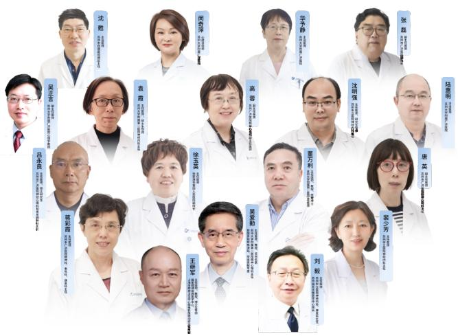

苏州姑苏优眠医学中⼼拥有⼀⽀由国内外知名专家组成的医疗团队，包括国家级精神⼼理科专家和临床经验丰富的治疗师。每位专家均拥有⾼级职称，平均从业经验超过30年，涵盖精神科、⼼理科、神经内科、中医康复等多个领域，能够充分发挥各⾃的专⻓，为精神⼼理疾病患者提供精准、⾼效的诊疗⽅案确保每个患者得到最优质的治疗。

# 全⾯⽽综合的服务体系

COMPREHENSIVEANDINTEGRATEDSERVICESYSTEM

苏州姑苏优眠医学中⼼的精准速眠解决⽅案以患者需求为核⼼，整合医⽣团队、中⼼资源和互联⽹医疗服务。结合⾃主研发的速眠脉冲磁治疗系统和CBTI数字化⼯具，运⽤多学科讨论模式，⼒求在短时间内精准识别患者的病因。

通过综合使⽤数字疗法、物理疗法和中医疗法 提供⾼效的专业诊疗服务。专家团队全天候在线，专注于解决焦虑、抑郁、睡眠障碍等问题 确保患者在整个治疗周期中获得⾼质量的⽀持与关怀。

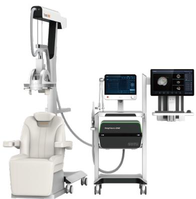

# 规范化

基于循证医学服务标准给予患者更全⾯的⽀持和照护

# 专业化

睡眠管理师、责任医⽣、医助给予患者专业的反馈、⼲预与治疗指导

# 实时化

通过睡眠管理师24⼩时关怀与呵护确保患者依从性与治疗效果

#

#

# 当天高效治疗精神心理疾病

斯坦福加速智能神经调控疗法(SAINT)由斯坦福⼤学脑刺激实验室研发，⽤于治疗精神⼼理科疑难杂症。SAINT结合功能连接MRI引导个体化靶点与间歇性爆发性θ波刺激。与传统rTMS相⽐，SAINT改变了作⽤位点、每次脉冲数和每⽇治疗数，在达到相应治疗量后该⽅案的缓解率达到了 $9 0 \%$ 。

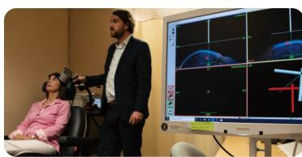

  
SAINT疗法在美国临床应用

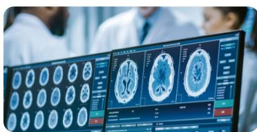

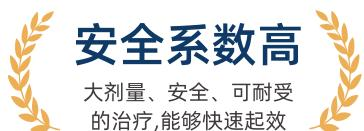  
SAINT疗法临床数据研究

  
斯坦福大学医学中心

# 治疗效果

斯坦福加速智能神经调控疗法(SAINT)当天即可快速缓解症状，效果惊⼈且快速，研究随访期间疗效持续存在。以下为《美国精神医学杂志》上的双盲、随机对照试验显⽰患者使⽤SAINT治疗后数据:

<table><tr><td>治疗天数</td><td>缓解率</td><td>有效率</td></tr><tr><td>第5天</td><td>当天恢复30%-40%左右(具体根据个人身体情况)</td><td>86.67%</td></tr><tr><td>第15天</td><td>53.33%</td><td>≈90.05%</td></tr><tr><td>第30天</td><td>93.33%</td><td>≈99%</td></tr></table>

# 适应症

抑郁症、焦虑症、强迫症、狂躁症、恐惧症、躯体症状障碍、双相情感障碍、精神分裂症(阳性、阴性症状)、PTSD、物质成瘾、ADHD、多动症、⾃闭症、孤独症、睡眠障碍、认知障碍、神经病理性疼痛等。

# 服务范围

MEDICALCENTERSERVICESCOPE

# 睡眠问题

SLEEPDISORDERS

# 失眠症

通过斯坦福加速智能神经调控疗法(SAINT）、经颅磁刺激（TMS）认知⾏为疗法等综合⼿段，帮助患者快速改善⻓期失眠。

# 睡眠呼吸暂停

使⽤睡眠脑电脉氧监测设备和个性化⼲预⽅案，解决睡眠呼吸紊乱，改善睡眠质量。

# 昼夜节律紊乱

为⻓期熬夜或作息不规律的患者提供科学的作息调整和疗法。

# 其他睡眠障碍

包括睡眠⾏为异常、嗜睡、夜惊症等复杂睡眠问题的全⾯诊疗。

# 不宁腿综合症(RLS)

帮助RLS患者缓解在休息或夜间时期的腿部不适，减少不⾃主活动冲动，改善睡眠和⽣活质量。

# ⻘少年⼼理

ADOLESCENTPSYCHOLOGY

# 情绪管理

帮助⻘少年学会管理情绪波动增强⾃我认知与情绪调节能⼒。

# ⻘春期⼼理⽀持

关注⻘少年在成⻓过程中的⼼理困扰，如叛逆期的情绪不稳、⾃我认同危机等。

# 学业压⼒与⼼理疏导

为⾯对学业压⼒、成绩下滑的⻘少年提供⼼理辅导，提升⾃信与学习状态。

# 焦虑与抑郁

ANXIETYANDDEPRESSION

# 焦虑症

采⽤认知⾏为疗法、药物治疗和放松训练等综合⼿段，帮助患者有效应对过度焦虑和恐慌情绪。

# 抑郁症

提供个性化的治疗⽅案，结合⼼理治疗与药物⼲预，帮助患者改善抑郁情绪，恢复⽣活动⼒。

# 强迫症

通过系统的认知⾏为治疗，帮助患者缓解强迫性思维和⾏为的困扰。

# 职业发展与⼈际交往CAREERANDINTERPERSONALRELATIONS

# 职场压⼒管理

针对职场⾼压环境中的情绪困扰和⼼理疲劳，提供⼼理⽀持和情绪疏导服务。

# 社交焦虑

为有社交恐惧、社交回避症的患者提供⼼理⼲预，提升社交能⼒，改善⼈际关系。

# ⼈际冲突调解

帮助患者应对⼈际关系中的冲突与⽭盾，提升沟通技巧，增强理解与合作。

# ⾃我成⻓与⼼理健康 SELF-GROWTH&MENTALHEALTH

# 自我认知与成长

帮助个⼈提升⾃我认知，发现潜⼒，追求⾃我成⻓，找到⼈⽣的⽅向和意义。

# 情绪调节

通过专业的⼼理咨询，帮助患者处理情绪问题，学习如何更好地⾯对和应对⽣活中的挑战。

# 压⼒管理

帮助个⼈应对⽣活和⼯作中的压⼒，提升抗压能⼒，保持⼼理平衡。

# 婚姻关系与家庭教育

MARITALRELATIONS&FAMILYEDUCATION

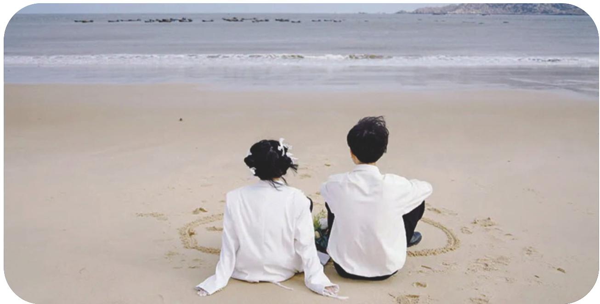

# 夫妻关系

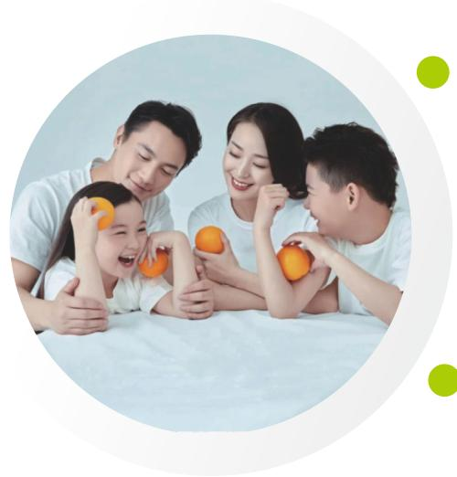

# 亲⼦关系调节

通过专业的婚姻咨询，帮助夫妻解决关系中的冲突和误解，增强情感连接。

通过亲⼦⼼理辅导，帮助家⻓与孩⼦改善沟通模式，增强家庭情感联系。

# 家庭教育指导

为家⻓提供教育孩⼦的科学⽅法和⼼理⽀持，帮助孩⼦在⼼理和学业上健康发展。

苏州姑苏优眠医学中⼼的精准速眠解决⽅案以患者需求为核⼼

整合医⽣团队、中⼼资源和互联⽹医疗服务

结合⾃主研发的速眠脉冲磁治疗系统和CBTI数字化⼯具

运⽤多学科讨论模式

⼒求在短时间内精准识别患者的病因

通过综合使⽤数字疗法、物理疗法和中医疗法

提供⾼效的专业诊疗服务

专家团队全天候在线

专注于解决焦虑抑郁、睡眠障碍等问题

确保患者在整个治疗周期中获得⾼质量的⽀持与关怀

# 检测仪器

# TESTING&PHYSICALTHERAPYINSTRUMENTS

# 近红外脑功能成像仪

# 看⻅情绪的“光学翻译官”

近红外脑功能成像技术(fNIRS)是近年来新兴的⼀种⾮侵⼊式脑功能成像技术、主要利⽤脑组织中的氧合⾎红蛋⽩和脱氧⾎红蛋⽩对600-900nm不同波⻓的近红外光吸收率的差异特性,来实时检测⼤脑⽪层的脑⾎流变化,进⽽判断⼤脑的神经活动情况。

fNIRS技术具有时间空间分辨率⾼、抗⼲扰能⼒强、运动容忍度⾼、⽆痛⽆创、兼容性好等特点。由于该技术适⽤于各类受试者⼈群以及环境，⾮常有利于开展⼀些贴近⽇常⽣活的脑功能测试，可为疾病的早期预防、诊断和治疗提供客观的影像学证据,⽬前已被⼴泛应⽤于精神⼼理、神经内科、康复、⼉童等神经科学的各个领域。

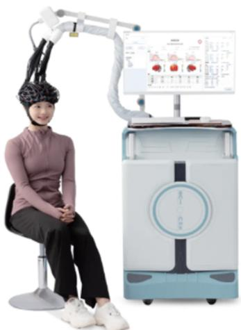

# 应⽤范围:

$\circledast$ 脑卒中的神经恢复监测、⼉童发育障碍(⾃闭症)的脑功能检测、精神疾病的诊断如抑郁症、精神分裂症。

# 适应症：

$\circledast$ 精神⼼理:抑郁症、精神分裂症、双相情感障碍、焦虑症、睡眠障碍、物质成瘾等。  
$\textcircled { \times }$ 神经内科:认知障碍、阿尔兹海默症、帕⾦森病、癫痫等；  
$\mathscr { C }$ 神经康复:神经疼痛、帕⾦森病、脑卒中、运动障碍、意识障碍等。  
$\circledast$ ⼉童康复:⾃闭症、多动症、阅读障碍等。  
$\circledast$ 体检中⼼:⼼理健康体检、认知健康状况评估。

# 脑电图脑地形图

脑电图(EEG)是通过精密的电⼦仪器，从头⽪上将脑部的⾃发性⽣物电位加以放⼤记录⽽获得的图形，是通过电极记录下来的脑细胞群的⾃发性、节律性电活动。脑电地形图(BEAM)是脑电波各频段内功率值⽤不同颜⾊表⽰的球⾯头⽪展成的平⾯图形，是对脑电图的再处理。

# 适应症：

$\mathscr { C }$ 中枢神经系统疾病：如各种脑炎、脑病;  
$\mathscr { C }$ 癫痫疾病的排查：

精神⼼理⾏为异常及智⼒发育障碍的检查：

如精神分裂症、焦虑抑郁、躁狂症、多动、抽动、⾃闭、语⾔发育障碍、智⼒低下、脑瘫、精神发育不良等;

$\mathscr { C }$ 睡眠障碍的诊断：

头晕、头痛、晕厥、昏迷、脑死亡辅助诊断之⼀;脑外伤及⼤脑术后恢复的检查等。

# 脑涨落图仪(神经递质功能检测仪)

脑涨落图仪(ET)是检查脑电与神经化学介质之间关系的设备。神经化学介质的存在是⼤脑活动的必要条件，⽽神经化学介质在脑内的⽣成，释放，摄取，代谢等活动的变化也必然对脑电产⽣影响。利⽤脑电超慢涨落原理和微电⼦技术/微机处理技术，通过多导联、⻓时程、频带，从脑波中采集a波占优势的频率，变频后进⾏多重频谱分析，提取隐含频率在毫赫兹范围内的超慢涨落振荡波，相当于掌握到神经化学递质的变化规律，可以作为对影像学检查(CT、MRI)的弥补。

# $\circledast$ 适应症：

精神分裂症、抑郁症、焦虑症、双相情感障碍、创伤后应激障碍、失眠、阿尔茨海默病、帕⾦森病、癫痫、注意缺陷与多动障碍、缺氧性脑病等。

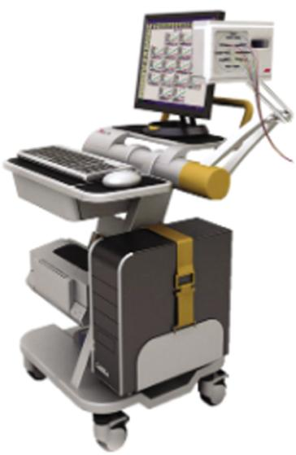

# 灵犀“SE”AI⼼理健康筛查系统

# 个体⼼理健康测评团体⼼理健康筛查

结合⾃主知识产权的⾯帧⼼理情绪识别、⼈脸情绪识别、眼动情绪识别等技术，采⽤多维度多模态⼼理情绪特征分析模型，实现对测试者⼼理情绪的科学趋向性分析与评估。

AI⼼理健康筛査系统技术结合⽣物统计学、⽣物测定学、视频捕捉分析算法、⽣物热⼒学等多个学科研发⽽成，通过捕捉分析视频影像中⼈物的头颈部肌⾁振幅和振动频率，结合⼼理⽣理学整理出的独有算法，达到判断⼈物潜在情绪的⽬的。

# 眼动检测分析仪

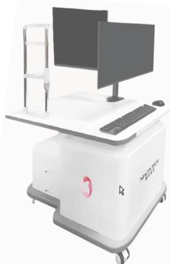

眼动检测分析仪是⼀种通过精密光学与图像处理技术，⾮侵⼊式捕捉并分析眼球运动轨迹和注视⾏为的设备。它能以毫秒级精度记录⽤⼾的注视点位置眼球转动路径和瞳孔变化，从⽽揭⽰视觉注意⼒分配和认知加⼯过程。眼动检测分析仪作为连接视觉⾏为与“内在认知”的桥梁,为精神⼼理和神经系统疾病提供了客观诊断⼯具。

# 物理治疗仪

# PHYSICALTHERAPYTHERAPEUTICINSTRUMENT

# MRI机器⼈

神经导航定位技术利⽤神经影像，由标准脑或患者个体的结构像或功能像定位靶点位置，计算出位于头⽪的TMS⼲预位置和⼊射路径。利⽤3D成像定位的原理，以MRI影像⽣成三维⽴体图显⽰在计算机屏幕上，再⽤3D光学扫描成像技术把受试者头颅、磁刺激线圈的三维图像对合叠加到MRI背景图像上，重建成TMS 实时刺激的导航定位图像。不但可以保证每次⼲预都能落在患者的特定脑区内,还能聚焦更⼩范围的⼦脑区，甚⾄可以为每位患者提供个体化靶点。

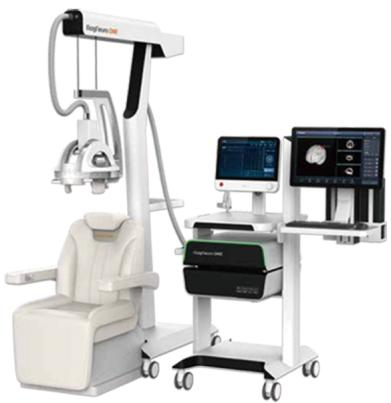

# 适应症：

$\circledast$ 可⽤于精神科  
$\mathscr { C }$ ⼼理科  
$\circledast$ ⼉少科  
$\mathscr { C }$ 神经调控中⼼  
$\circledast$ 辅助精准治疗多种精神及神经性疾病

# 经颅磁刺激技术

经颅磁刺激(TMS)技术，利⽤时变的脉冲磁场穿透颅⻣，在⼤脑神经元细胞中形成感应场，进⽽产⽣感应电流作⽤于神经系统，引起⼀系列⽣理⽣化反应，从⽽影响脑内代谢和神经元兴奋性改变，达到改善及治疗精神和神经疾病的作⽤。

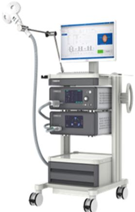  
$\circledast$ 适应症：

抑郁症、强迫症、创伤后应激障碍、焦虑症、精神分裂症、物质依赖、睡眠障碍、帕⾦森病、阿尔茨海默病、意识障碍、癫痫、多发性硬化

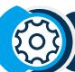

# Tomatis听觉康复训练仪

托 ⻢ 迪 斯 运 ⽤“E l e ct ro n i c E a r (电 ⼦ ⽿)及“Sonic Rebirth(⾳波再⽣)”技术,结合多种声⾳材料，促进神经系统更好地连接，形成更庞⼤的神经⽹络，提⾼神经元的传输速率，从⽽提⾼外在的语⾔、学习、注意⼒等各种⾏为及能⼒表现。这个⽅法被称为“Tomatis Method”,即Tomatis听觉康复训练。

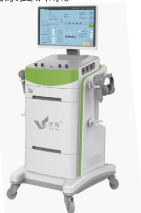  
$\mathscr { C }$ 适应症：

孤独症谱系障碍(ASD)、注意缺陷多动障碍(ADHD)、注意⼒缺陷(ADD)、听觉处理障碍、学习障碍、感觉统合失调、卒中后认知功能障碍、焦虑、抑郁

# 经颅电刺激技术

经颅直流电刺激(transcranial direct currentstimulation,tDCs)主要通过置于头颅部位的电极,将特定的、低强度的电流(通常为1-2mA)作⽤于特定的脑区,从⽽达到调节⼤脑⽪层神经活动的⽬的。经颅交流电刺激(transcranial alternating currentstimulation,tACs),是⼀种通过置于头⽪的电极,将特定频率的低强度交流电(正弦、双相)作⽤于⽬标脑区,调节⼤脑⽪层神经活动的⾮侵⼊性刺激技术。可调节内源性神经振荡,诱导突触可塑性变化,改善⼤脑功能。

  
适应症：

$\circledast$ 睡眠障碍   
$\circledast$ 抑郁症  
$\circledast$ 焦虑症  
$\circledast$ 躁狂症  
$\mathscr { C }$ 精神分裂症  
$\circledast$ 物质成瘾   
$\mathscr { C }$ 癫痫   
$\circledast$ 神经病理性疼痛  
$\mathscr { C }$ 帕⾦森病认知功能障碍  
$\circledast$ 脑卒中后运动功能障碍和失语等

# 团体⽣物反馈仪

作⽤机制:利⽤⽣物反馈的技术原理，通过采集、转化和反馈肌电、⼼率和脑电3个参数，从⾝、⼼、脑3个维度评估患者整体状态，实现更加准确、灵敏的治疗反馈。通过提升a波、△波和SMR波等参数，同时降低⾼频B波和θ波，能够有效缓解焦虑情绪、改善抑郁状态，以及促进睡眠质量的调整，重建⼼理健康。

# 适应症：

$\mathscr { C }$ 焦虑症  
$\mathscr { C }$ 恐惧症  
$\mathscr { C }$ 抑郁症  
$\mathscr { C }$ 精神分裂症康复期  
$\circledast$ 创伤性应激障碍   
$\circledast$ 紧张性头痛   
$\circledast$ 偏头痛 1   
$\mathscr { C }$ 失眠   
$\circledast$ ⼉童多动症  
$\mathscr { C }$ 抽动症  
$\mathscr { C }$ 孤独症  
$\circledast$ 注意障碍等

# 专家团队

# MEDICALEXPERTTEAM

# 苏州姑苏优眠医学中⼼

汇聚了⼀批以吴爱勤院⻓为代表的国家级、教授级专家

拥有⾼度丰富的临床经验与深厚的专业知识。

致⼒于为每⼀位来访者提供⾼质量的医疗服务

并在治疗⽅案的制定、实施和评估过程中确保个体化、专业化的治疗体验。

专家团队涵盖精神科、⼼理学、神经科学、中医康复等多个领域

能够充分发挥各⾃的专⻓，

为精神⼼理疾病患者提供精准、⾼效的诊疗⽅案

同时,优眠专家团队积极参与学术研究与培训，

推动精神⼼理健康领域的前沿发展，

针对复杂案例提供精准的诊断与治疗建议，

帮助患者在专业的⽀持下重获⾝⼼的平衡与和谐。

  
吴爱勤  
教授/主任医师

历任苏州医学附属第⼀医院院⻓、苏州⼤学医学院院⻓  
苏州⼤学附属第⼀医院精神⼼理科主任医师、教授、苏州名医  
获“全国⼗⼤医学促进贡献专家”荣誉称号，享国务院特殊津贴  
苏州姑苏优眠医学中⼼名誉院⻓

苏州医学院医学⼼理研究所副所⻓  
中华医学会⼼⾝医学分会前任主委、第五、六届主任委员  
历任中国医学⼼理学专委会副会⻓、⼼理咨询师培训专家顾问督导  
$\scriptstyle \frac { - 1 } { 7 }$ 国际⼼⾝医学研究学会委员  
. 擅⻓诊治⼼⾝障碍疑难杂症、失眠、神经衰弱、焦虑症、惊恐发作、抑郁障碍、躯体疼痛障碍、强迫症、精神疾病、情感障碍、认知障碍等。⼉童⻘少年⼼理问题、⾏为情绪障碍、⽹络成瘾、学习困难，⾃伤⾃残、进⻝障碍等。每年1200多例⼼理治疗成功案例。

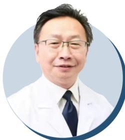  
刘毅  
中⼼院⻓/主任医师

苏州姑苏优眠医学中⼼院⻓  
苏州市⽴医院主任医师  
历任苏州市⽴医院神经内科、康复科主任  
苏州市康复医学会秘书⻓  
苏州市医学会⼼⾝专业委员会顾问委员  
苏州市医学会神经内科专业委员会委员  
苏州市医学会⽼年专业委员会神经精神专业学组委员  
. 擅⻓脑⾎管病、帕⾦森病、痴痫、睡眠障碍、眩晕等疾病诊治。⽼年步态障碍、眩晕、睡眠障碍及神经功能康复。对神经疾病引起的⼼理问题如焦虑、抑郁等治疗有着较丰富的临床经验。

  
王继军  
教授/主任医师

上海市精神卫⽣中⼼主任医师、教授  
上海交通⼤学博⼠⽣导师  
国家精神疾病医学中⼼、上海市精神卫⽣中⼼脑电影像眼动研究室主任  
中国科学院脑科学与智能技术卓越创新中⼼脑疾病研究⽅向客座研究员  
$\frac { 1 } { x }$ 科技部2030脑计划重⼤研发平台评审专家  
$\ast$ 曾多次获得卫⽣部和上海市科技进步奖及华夏医学科学技术进步奖三等奖并被评为中国医师会杰出精神科医师  
. 擅⻓于精神分裂症、抑郁症、认知症、焦虑症、双相情感障碍等精神类疾病的诊断与治疗。精通重复经颅磁刺激（rTMS）、经颅电刺激（tDCS）等先进物理治疗技术，率先在国内引进重复经颅磁刺激和磁抽搐治疗，为精神、⼼理疾病患者的治疗带来突破性进展。

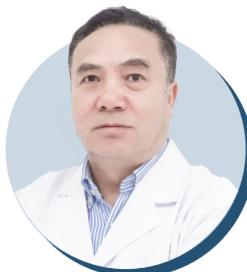  
董万利  
教授/主任医师

苏州⼤学附属第⼀医院主任医师、教授、博⼠⽣导师、医学博⼠  
苏州⼤学附属第⼀医院主任医师  
苏州⼤学附属独墅湖医院神经内科主任

曾任苏州⼤学附属第⼀医院神经科科主任和神经病学教研室主任20余年  
担任江苏省卒中学会卒中营养⽀持治疗专业委员会主任委员  
中国医师协会中西医结合神经病学分会常委  
江苏省医学会神经专业委员会委员

. 擅⻓神经⾃⾝免疫疾病和中枢神经系统感染疾病；眩晕、头痛和癫痫类发作性疾病；脑⾎管病和⼼⾝疾病诊治。尤其擅⻓眩晕症的诊断及治疗，亲⾃诊治来⾃全国各类眩晕患者数万⼈，诊断准确，疗效突出。

  
唐英  
副主任医师

苏州⼤学附属⼴济医院副主任医师  
历任苏州⼤学附属⼴济医院精神⼼理科主任  
苏州⼤学副教授  
国家⾼级⼼理治疗师  
曾任苏州⼤学附属⼴济医院精神⼼理科医师及主任40余年  
中国⼼理卫⽣协会会员、精神科学会会员  
专注于睡眠障碍、抑郁症、焦虑症、双相情感障碍、惊恐发作、躯体形式障碍、强迫症、认知障碍以及精神分裂症等精神、⼼理疾病的诊断与治疗。尤其擅⻓处理由多种躯体疾病引发的精神障碍等疑难杂症。同时拥有中国科学院⼼理咨询与治疗专业证书，擅⻓⻘少年⼼理危机⼲预和各类⻘少年⼼理问题的⼼理治疗。的⼼理治疗。

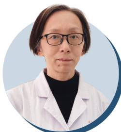  
袁霞   
主任医师

苏州⼤学附属第⼀医院主任医师、硕⼠⽣导师  
历任苏⼤附⼀院神经内科主任

曾在北京医科⼤学附属第⼀医院“失语学习班”进修学习  
在神经内科专业的周围神经疾病、脊髓疾病、脑⾎管病、中枢神经系统感染、头痛、癫痫、睡眠障碍、神经肌⾁疾病、神经系统变性疾病等的诊断和治疗上，积累了丰富的经验。擅⻓周围神经疾病、脊髓疾病、脑⾎管病、中枢神经系统感染、脱髓鞘疾病、运动障碍性疾病、头痛、癫痫、睡眠障碍、神经肌⾁疾病、神经系统变性疾病等的诊断和治疗及各类失语症等⼼理疾病的诊治。

  
吴正⾔

⼼理学教授/副主任医师

苏州⼤学附属⼴济医院⼼理学教授、副主任医师  
湖北省精康医学研究院副院⻓  
苏州城市学院兼职教授  
曾任苏州市⼴济医院⼼理健康服务中⼼主任

江苏省⼼理卫⽣协会理事  
苏州市⼼理健康协会秘书⻓  
苏州市未成年⼈健康成⻓指导中⼼副理事⻓   
苏州市⼼理救援专家组副组⻓  
苏州市⾸批中⼩学⼼理副校⻓

. 擅⻓各类精神障碍的临床评估与综合⼲预，如各种原因引起的睡眠障碍、抑郁、焦虑、强迫症、社交恐怖症、癔症等精神疾病的诊治；各类应激后的⼼理危机⼲预与救援；尤其擅⻓⻘少年⼼理问题⼼理咨询疏导，如：⻘少年的焦虑、抑郁及厌学等⼀系列⼼理问题的疏导，包括相应的家庭⼼理指导等。

  
吕永良  
主任医师

$\downarrow \downarrow$ 苏州⼤学附属⼴济医院主任医师、硕⼠研究⽣  
历任苏州⼤学附属⼴济医院神经⼼理科和⽼年精神科主任

历任江苏省医学会⼼⾝与⾏为医学分会委员江苏省医学会精神病学分会委员  
$^ { \circ }$ 苏州市医学会精神病专业委员会常务委员  
江苏省临床重点建设专科及苏州市临床重点专科学科带头⼈

从事神经⼼理科临床⼯作40余年，擅⻓认知.⾏为治疗、森⽥治疗和家庭⼼理治疗。对睡眠障碍、焦虑障碍、抑郁障碍、精神分裂症尤其对妇⼥和⽼年⼼理障碍的诊断及治疗具有丰富的临床经验。

  
蒋彩霞   
主任医师

苏州⼤学附属⼴济医院精神⼼理科主任医师  
先后担任苏州市⼴济医院精神科病区主任、⽼年科  
主任、精神康复科主任  
济宁医学院精神病学兼职教授

历任第⼋届中国⼼理卫⽣协会残疾⼈⼼理卫⽣分会委员  
第⼀届江苏省康复医学会精神康复专业委员会委员  
第⼀、⼆届苏州市医学会精神病学专业委员会委员  
多次被评为苏州市卫⽣系统“医德医⻛标兵”、苏州市卫⽣健康系统“⽼⻩⽜”等光荣称号  
从事精神科临床、科研、教学⼯作30余年精通睡眠障碍，焦虑症，抑郁症，躁狂症精神分裂症等精神障碍的诊治与康复，具有丰富的临床经验和深厚的学术造诣。

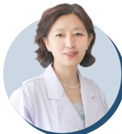  
裴少芳   
主任医师

苏州市⽴医院北区主任医师

$^ { \ast }$ 历任苏州市医学会神经病专业委员会委员脑⾎管疾病学组副组⻓  
苏州市医学会脑卒中专业委员会委员兼秘书  
苏州市医学会⼼⾝疾病专业委员会委员  
苏州市医学会睡眠专业委员会委员  
曾多次获得“苏州医疗卫⽣⾏业”“⼗⼤服务明星、“苏州中帼建功标兵”等荣誉称号  
擅⻓脑⾎管疾病、周围神经病类、头痛、颅内感染及癫痫等神经内科疾病的诊治；尤其对中枢神经系统感染性疾病具有丰富的临床诊治经验;在认知障碍;睡眠障碍、情感障碍(抑郁、焦虑障碍)等⾝⼼疾病也有较丰富的临床经验。

  
张磊  
副主任医师

苏州⼤学附属⼴济医院精神⼼理科副主任医师  
历任苏州市⼴济医院科主任、医务科⻓和业务副院⻓  
苏州市医学会精神分会委员和苏州巿医疗事故鉴定委员会专家库成员并担任司法精神病鉴定及残疾鉴定的主检主任医师  
. 专注于抑郁症、焦虑症、双相情感障碍及睡眠障碍的诊治，尤其在这些常⻅精神障碍的早期诊断与个性化治疗⽅⾯积累了丰富经验。对于复杂、疑难病例，能够提供综合评估与科学的治疗⽅案。在情感障碍及睡眠障碍领域，积累了⼤量的临床实践和研究经验。

  
徐⽟英  
主任医师

$\forall \ : \mathcal { Y }$ 张家港第四⼈⺠医院主任医师  
$\downarrow \langle$ 历任张家港第四⼈⺠医院副院⻓

$^ { * }$ 中华医学会会员  
$^ { \circ }$ 苏州市医学会精神病专业委员会委员  
苏州市医学会⽼年医学分会委员  
? 熟练掌握精神分裂症、⼼境障碍及酒精性精神障碍等功能性疾病的诊治。对各种原因引起的睡眠障碍、抑郁、焦虑、强迫症、社交恐怖症、癔症、疑病、慢性躯体疼痛不适等神经症的诊治，专⻓于产后、脑⾎管意外、肿瘤、⽼年性痴呆等重⼤躯体疾病所伴发的抑郁等精神障碍诊治，以及应激性精神障碍、恋爱婚姻家庭问题、⻘少年⼼理问题等危机⼲预。

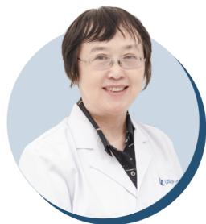  
⾼蓉   
副主任医师

苏州⼤学附属⼴济医院精神⼼理科副主任医师  
从事神经精神科、少⼉精神临床⼯作近40年  
. 对神经精神疾病诊断、⼼理应激障碍、⼼理咨询及⼉童⼼理⾏为障碍和情绪障碍诊断及治疗有丰富临床经验。精通各类神经精神疾病的诊断与治疗，特别在⼼理应激障碍、情绪障碍（如抑郁、焦虑症）及⼼理问题的早期识别和⼲预⽅⾯具有丰富经验。⻓期从事⼉童及⻘少年⼼理健康问题的诊疗⼯作，擅⻓应对学习困难、注意⼒缺陷、⼉童孤独症及⾏为问题等多种⼉童⻘少年⼼理障碍的治疗与指导。

  
沈明强  
主任医师

苏州市⽴医院主任医师  
南京医科⼤学硕⼠⽣研究⽣导师

历任江苏省卒中学会认知和精神障碍专业委员会委员  
江苏省卒中学会基层医疗与慢病管理委员会常务委员  
江苏省医师协会神经调控专业委员会委员  
苏州市医学会神经病学专业委员会委员

. 擅⻓诊治脑⾎管疾病（如脑卒中、脑梗塞、脑出⾎等）、眩晕、帕⾦森病、神经系统变性疾病、睡眠障碍及各类疑难神经系统疾病。研究领域主要集中在脑⾎管病和运动障碍性疾病，具备深厚的科研基础和临床实战能⼒。

  
闵奇萍   
中⼼院⻓/⼼理咨询师

苏州姑苏优眠医学中⼼院⻓

上海第⼆医科⼤学护理本科、中科院⼼理咨询专科毕业  
副主任护师、研究员三级岗

苏州市医学会健康管理学会专业委员会常务理事  
苏州市预防医学会职业健康检查质量管理专业委员会副主委  
江苏省医院协会医院⽂化建设专业委员会委员  
在苏州市⼴济医院从事精神卫⽣⼼理护理和⼼理咨询⼯作三⼗余年。曾在加拿⼤霍尔姆德精神卫⽣中⼼参加精神⼼理问题⼲预培训。擅⻓各类精神疾病患者康复期的⼼理⼲预，⽼年及成年⼈焦虑抑郁、强迫等精神⼼理问题的早期⼲预，擅⻓应⽤认知和⾏为疗法。

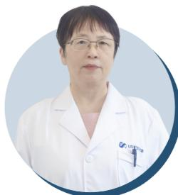  
华予静  
主治医师

苏州⼤学附属⼴济医院主治医师

$\ast$ 定期在各类学术会议上发表主题演讲，分享前沿研究成果，参与多项科研课题  
⻓期负责临床⻘年医师的带教指导⼯作

从事临床神经、精神⼼理科⼯作40余年，专注于睡眠障碍、抑郁症、焦虑症、双相情感障碍、精神分裂症等精神疾病的诊断与治疗，尤其擅⻓处理由躯体疾病引发的精神障碍。对中⽼年⼈群体的情绪问题和⻘少年⼼理危机⼲预有深⼊的理解与丰富的实操经验，对各种精神⼼理困扰的患者在治疗上有着尤为显著的效果，深受⼴⼤精神疾病患者及家属的好评和业界的⾼度赞扬。

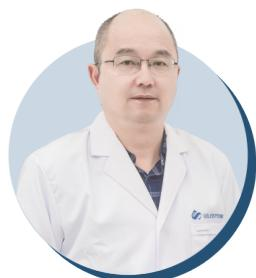  
陆惠明  
主治医师

苏州⼤学附属⼴济医院主治医师  
历任苏州市⼴济医院及多家社区精神卫⽣中⼼坐诊专家  
苏州市吴县精神⼼理专科医院担任病区负责⼈和学科带头⼈  
从事精神、⼼理卫⽣⼯作40年余，擅⻓睡眠障碍、.⽼年性痴呆症早期诊断预防、焦虑抑郁症、双相情感、精神分裂等障碍的诊断和⼲预及⻘少年厌学、认知、⾏为障碍等治疗。具有丰富的临床经验和专业学术⽔平。

  
沈甦  
主治医师

历任苏州市⺠康医院病区主任  
苏州市⺠康医院主治医⽣

⺠康医院精神专科学科带头⼈，从事精神科临床⼯作四⼗余年  
. 擅⻓常⻅精神疾病如精神分裂症、抑郁症、双向情感障碍、脑器质性精神障碍的诊治与康复指导。对躯体化障碍、焦虑症、强迫症、睡眠障碍等常⻅精神疾病与⼼理问题提供诊治、咨询与⼼理辅导。

# ⼼理咨询服务

# PSYCHOLOGICALCOUNSELINGSERVICE

苏州姑苏优眠医学中⼼提供多种形式的⼼理咨询服务，以满⾜不同患者的需求，帮助他们有效应对⼼理困扰与情感问题。

# 个体咨询

适⽤⼈群:⾯临情绪障碍、焦虑、抑郁等⼼理困扰的个⼈。

服务内容:提供⼀对⼀的专业⼼理⽀持，帮助患者深⼊理解⾃⾝感受，探索解决⽅案。

# 家庭咨询

适⽤⼈群:存在家庭关系困扰、沟通障碍的家庭成员

服务内容:通过对家庭动态的分析和指导，改善家庭成员之间的理解与互动，促进和谐关系。

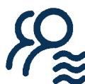

# 团体咨询

适⽤⼈群:希望在⽀持性环境中分享经历、获得反馈的个体。

服务内容:通过⼩组讨论和互动，参与者能够分享⾃⾝经历，增强社交能⼒，互相⽀持与理解。

# ⼼理咨询服务流程

PSYCHOLOGICALCOUNSELINGSERVICEPROCESS

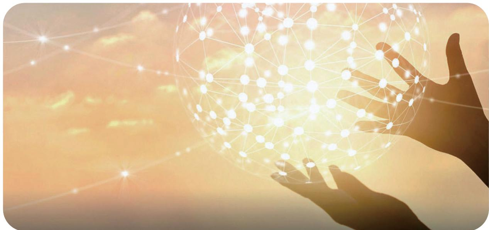

苏州姑苏优眠医学中⼼⼼理咨询师均经过专业培训，持有相关资质，并具备丰富的咨询经验。咨询师们擅⻓运⽤多种⼼理治疗⽅法，帮助患者针对具体问题制定有效的解决⽅案。

# 初步评估

通过问卷与⾯谈，全⾯了解患者的⼼理状况和需求。

# 制定个性化⽅案

在评估基础上，与患者共同制定明确的咨询⽬标和计划

# 定期咨询会谈

根据计划定期进⾏会谈 深⼊探讨问题，提供⽀持与建议。

# 进展评估

定期回顾患者的⼼理变化与进展，必要时调整咨询⽅案。

# 后续⽀持

提供结束后的⽀持与指导，帮助患者在⽣活中持续运⽤所学技巧。

# 荣誉资质

# HONORSANDQUALIFICATIONS

#

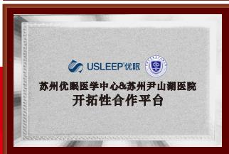

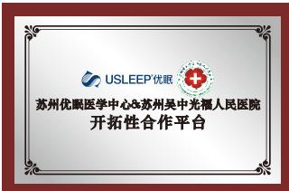

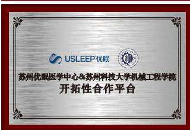

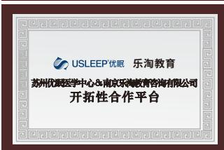

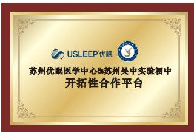

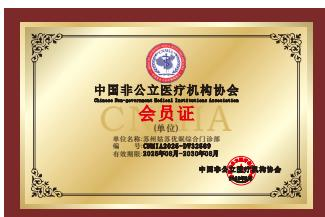

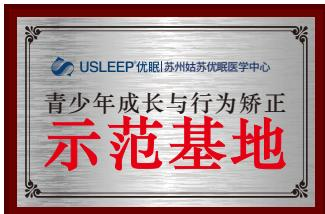

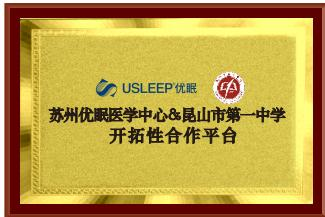

# 苏州姑苏优眠医学中⼼周边交通指引

SURROUNDINGTRAFFICGUIDANCE

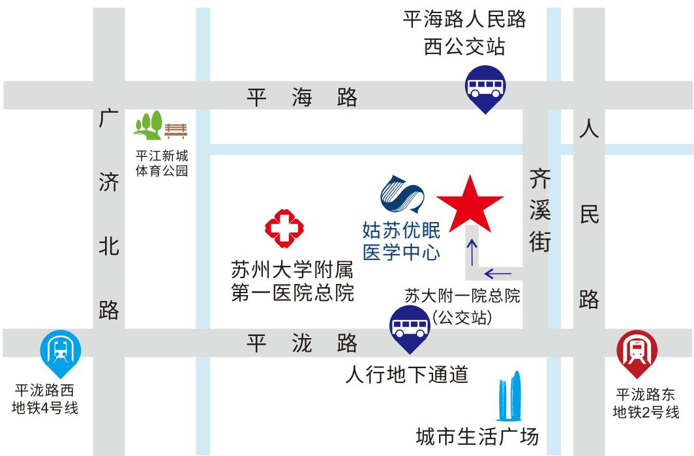

# 公交路线：

8⽀线、9013、9013⽀线、9035路苏⼤附⼀院总院下⻋;

36、980、9025路平海路⼈⺠路西下⻋。

# 地铁路线:

地铁2号线平泷路东下⻋平泷路出⼝、地铁4号线平泷路西下⻋3号出⼝。

# ⾃驾停⻋路线：

导航⾄姑苏区⻬溪街899号地下停⻋库，根据指⽰牌指引乘坐电梯上4楼。

苏州姑苏优眠医学中⼼⾃成⽴以来，始终秉持患者⾄上"的理念积极推动诊疗体系的完善与发展。秉持七⼤品质的核⼼理念，具体包括⼀流⼈才、⼀流管理、⼀流机制、⼀流设备、⼀流技术、⼀流环境和⼀流服务，开创新格局，确⽴区域特⾊精神⼼理专科品牌。

未来，苏州姑苏优眠将继续深化在精神⼼理健康领域的研究与实践,结合现代科技与传统治疗⽅法，不断提升服务品质与医疗⽔平，为更多居⺠的⼼理健康与睡眠改善贡献⼒量。

白天有说有笑

晚上睡个好觉

  
手机扫码获取更多资讯

USLEEP?姑苏优眠

苏州姑苏优眠医学中心

VIP|0512-66215999

热线|18206250907

地址：江苏省苏州市姑苏区齐溪街899号3幢4F